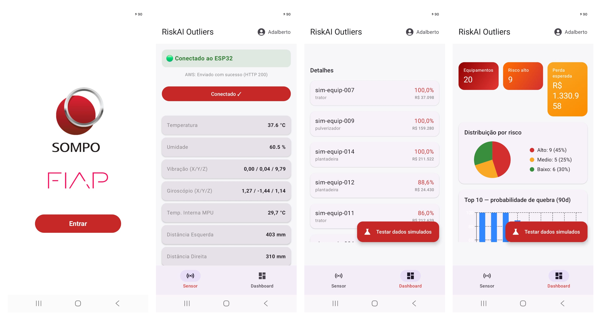

# RiskAI

Plataforma IoT + IA de monitoramento de risco operacional de maquinário, desenvolvida para o Challenge Sompo Seguros (FIAP 2026).

> Este repositório é uma vitrine do projeto. O código-fonte é privado e pode ser apresentado mediante solicitação ao time.

## O problema

Seguradoras precificam o risco de máquinas e frotas com pouca informação sobre como elas são realmente operadas. Quebras e sinistros são percebidos só depois que acontecem.

## A solução

Sensores embarcados no equipamento enviam telemetria para um app Android, e um pipeline de IA na nuvem transforma essas leituras em risco e perda financeira esperada:

1. **Captura (IoT):** ESP32 com sensores de temperatura, umidade, vibração/inclinação e distância, transmitindo via Bluetooth Low Energy.
2. **App Android:** recebe a telemetria, autentica o usuário e envia para a nuvem, inclusive em segundo plano.
3. **Classificação de risco:** modelo de Machine Learning classifica cada leitura.
4. **Previsão de quebra:** modelo de análise de sobrevivência estima a probabilidade de falha e a perda esperada em R$, considerando histórico, cadastro e clima da região.
5. **Dashboard:** ranking de equipamentos por risco, gráficos e relatórios exportáveis para o gestor.

## Funcionalidades

- Perfis Gestor e Operador, com controle de acesso por perfil.
- Ranking de risco da frota e perda esperada em R$.
- Alertas em tempo real enviados pelo próprio equipamento.
- Alerta de proximidade de água por GPS.
- Registro automático de sinistro com foto e vídeo.
- Relatórios em PDF, DOCX e XLSX.
- Site web do gestor.
- Assistente virtual por voz e texto (Mamori).

## Tecnologias

- **IoT:** ESP32, C++ (PlatformIO)
- **Mobile:** Kotlin, Jetpack Compose, BLE
- **Nuvem:** AWS (API Gateway, Lambda, DynamoDB, Cognito, S3)
- **IA/ML:** scikit-learn, lifelines, visão computacional, Gemini
- **Web:** Next.js, TypeScript, Tailwind

## Demonstração

- Vídeo:https://youtu.be/GSfibnsm00Y 

_Equipamentos simulados para teste._

## Time Outliers — FIAP

Adalberto Alves Cruz, Bruno Henrique Ferreira Ambrosio, Gustavo da Silva Nascimento, Lucas Maximo dos Santos, Renan de Assis Rodrigues, Tiago Thomaz Cesaro.

## Licença

Todos os direitos reservados. Veja [LICENSE](LICENSE).
